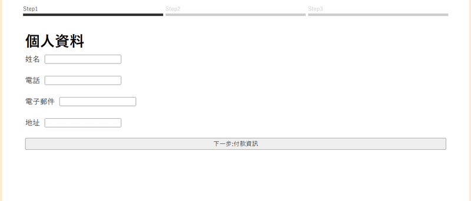

# jQuery E-commerce Website

製作實際電商網站會有的幾個常見功能，大部分皆Vanilla Javascript為主，API部分會以jQ為主

---

## 預期功能介紹

- 會員註冊、登入(以localStorage作為資料儲存區域) (2025/04/14新增)
- 商品列表展示（jQuery 配合JSON檔案 動態渲染）(2025/04/15新增)
  - 分頁 
  - 分類 
  - 搜尋(2025/05/06新增)
- 商品加入購物車，存進會員資料庫(2025/04/22新增)
- 購物車(2025/04/24新增)
  - 商品數量增減、移除
  - 金額計算
  - icon更新
- 結帳頁面(2025/05/01新增)
  - 練習串接金流系統API
  - 儲存進歷史訂單
  - 結帳寄送訂單email確認信
---

## 使用技術

- HTML5 / CSS3 / SASS(SCSS)
- JavaScript / jQuery
- Ajax fetch（若有模擬串接 API）
- localStorage sessionStorage（模擬儲存購物車資料）

---

## 專案畫面

首頁預覽：


購物車畫面：


結帳畫面：




---

## 如何使用

1. 將此專案 clone 至本機端：
   ```bash
   git clone https://github.com/tamytammy/ecommerce-website.git

---

##作者資訊
小德 Email: momo09041027@gmail.com
請不吝指教！